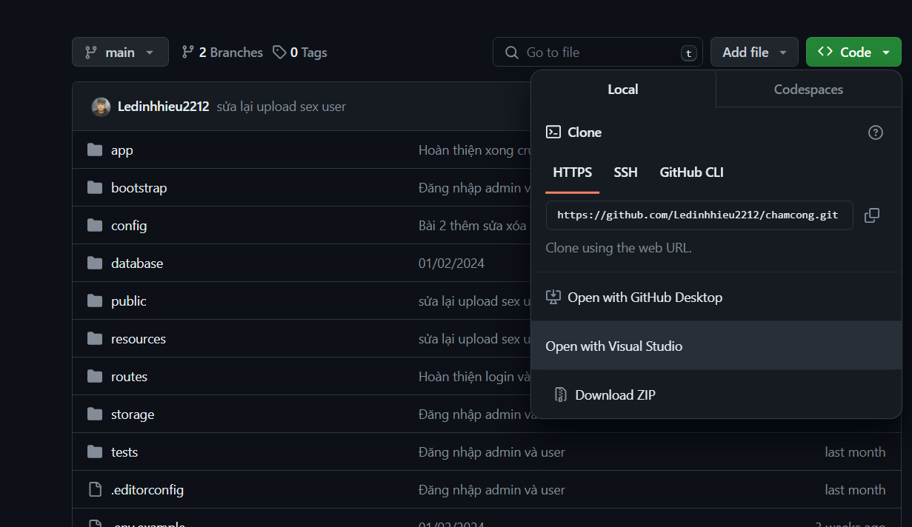
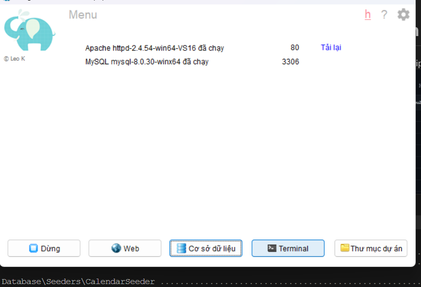

# 1. Cài đặt phần mềm:
 - VSCode
 - Laragon
 - Composer
# 2. Các framework sử dụng trong dự án:
- Laravel
# 3. Cách chạy code
dowload file zip và giải nén

Chuyển file đã giải nén vào C:\laragon\www
Mở laragon và ấn nút chạy và mở terminal

# 4. Reset seeder
    
    php artisan migrate:refresh --seed
